# David the Helldiver

## 游戏设计文档


引擎：Unity 6000.3.8f1（URP 2D）  

----------

# 1. 游戏概述

## 1.1 游戏定位

《David the Helldiver》是一款融合《潜水员戴夫》游戏风格和资源探索玩法，以及《绝地潜兵2》世界观与战斗要素的横版2D像素风格水下动作采集类游戏。

## 1.2 游戏背景

玩家将扮演超级地球远征军中一名因故远离前线名为David的绝地潜兵，被投放至一处偏远的行星科研站，负责领导这里的守备部队并保卫这里的科研人员。该科研站发现，当地的海域中出现了大量的710物质和疑似变异进化出水生能力的终结族群落，并且近期该星球及科研站还受到了光能族罕见地频繁进攻。为了调查这些异常现象，玩家奉命在白天探索海域深处，为科研站搜集生物样品和资源，晚上则负责指挥科研站抵御光能族的进攻。

## 1.3 核心玩法

| 横版《David the Helldiver》是一款横版2D像素风格的类潜水员戴夫游戏。玩家将扮演一名绝地潜兵，在白天中探索神秘深邃的海洋，遭遇各种各样的生物战斗并搜集资源，推进科研站进展，升级武器和装备。晚上则指挥当地人员保卫科研站。最终逐渐解开各种异常背后的真相 | 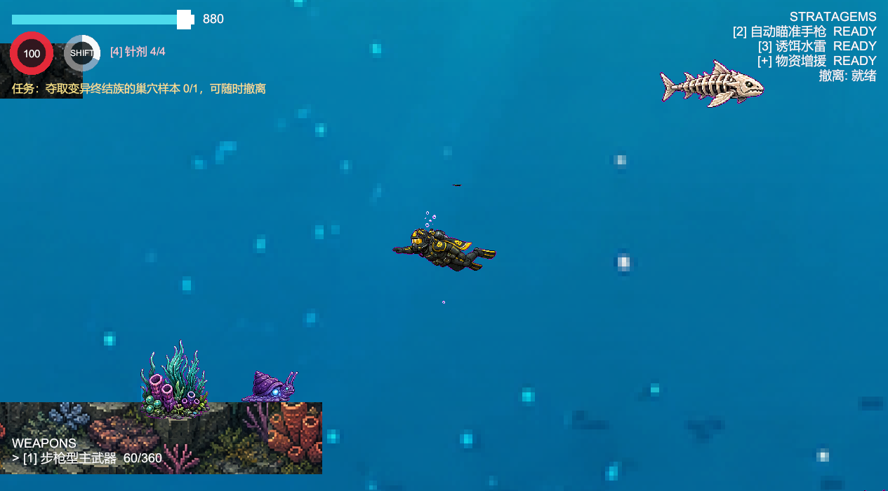 |
| :----------------------------------------------------------- | ------------------------------------------------------------ |
| 和《潜水员戴夫》游戏类似，本作将采用“双线战斗与收获升级”的设计，同时针对原作较为薄弱的战斗和怪物设计，学习《绝地潜兵2》的设计思路，让玩家通过丰富的怪物和灵活的武器搭配，获得更加多样的战斗体验和更高的收集成就感。 | 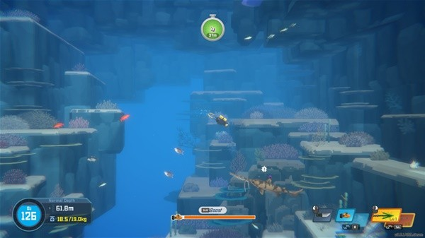 |
| 在本作中，绝地潜兵的战备呼叫系统被拆分成两个部分，分别负责白天与晚上的战斗过程。白天的战斗为单人水下探索，晚上的战斗则为轻度塔防模式。此外玩家在探索过程中，将随着探索的深入以及时间的推进，逐步揭开事件背后的真相，为玩家带来持续的剧情吸引力 | 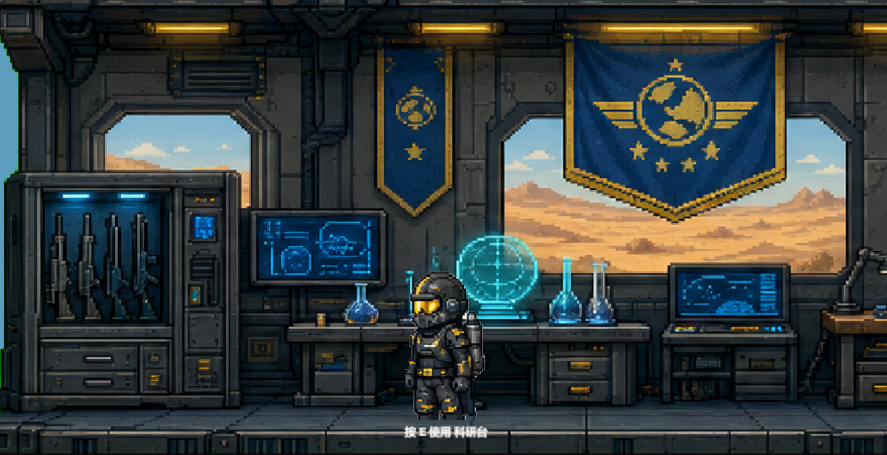 |


## 1.4 设计目标  

游戏的目标人群为喜爱战斗+资源采集循环玩法，升级但想要更具挑战性的探索与战斗过程的玩家。本作希望能结合潜水员戴夫优秀的资源升级系统以及绝地潜兵2丰富的战斗系统和怪物设计思路，为玩家带来更加爽快的体验。**需要说明的是，该项目本身的目的为验证、展示游戏策划方案，说明游戏的整体设计思路**。游戏中部分要素和背景世界观使用其他游戏中的内容仅为个人喜好，不代表本人在实际游戏制作过程中认可或采取这种做法。此外，为了在较短时间内尽可能完整的展现游戏内容，该项目在实现过程中使用了AI工具辅助制作。


----------

# 2. 玩法设计

## 2.1 单局流程

```text
玩家投放进入海域 → 探索地图与洞穴 → 遭遇敌人与中立单位 → 采集资源与样本 → 完成任务目标 → 呼叫撤离 → 返回科研站
      ↑                                                                                   ↓     
装备选择和升级 ←-- 新任务和剧情  ←-- 返回科研站  ←--  成功抵御进攻  ←--  进入夜晚防御阵地  ←--  装备选择和升级
```

----------

## 2.1 玩法循环

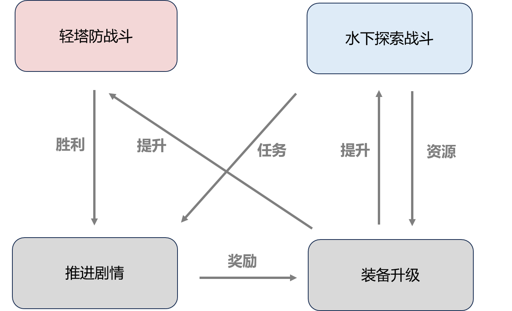

## 2.3 玩法细节

### 科研站设计

科研站是玩家进行战斗准备和装备升级的场所，也是任务剧情主要发生以及串联两个战斗玩法的核心场景。

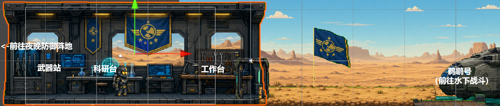

### 单人水下战斗设计

白天玩家投入海洋发生战斗，搜集样本和其他各式资源，完成任务最后撤离。玩家未完成任务也可撤离，但无法获得关键奖励和推进剧情。玩家在每局战斗中都需要根据氧气+生命+体力（左上角）、任务要求（左上角）、武器弹药（左下角）、战备冷却（右上角）、背包重量等选择战斗和探索的时机。


### 轻塔防战斗设计（暂未实装）

左侧为光能族进攻敌人，右侧为玩家防守阵地。玩家可通过战备呼叫（右上角）武器对敌人进行攻击。鼠标可选择哨戒炮等阵地武器的落点（右下角红标）。阵地上有自动攻击的seaf友方作战部队，作战人数和攻击力会随着科研站的升级和人数的增加（左下角）而增加。每次战斗敌人将分多个批次进攻，批次越后数量越多。战斗胜利将推进剧情并获得奖励，失败将为白天的战斗探索带来debuff

 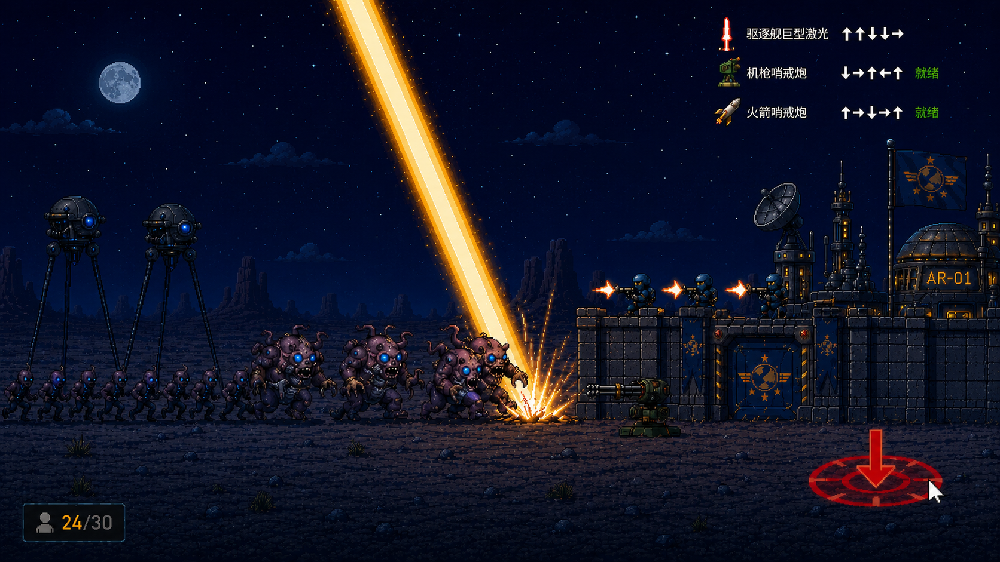


# 3 系统设计

## 3.1 角色

- 基本操作：与《潜水员戴夫》游戏类似，通过WASD水下移动，shift消耗体力冲刺，鼠标控制射击和射击方向、
- 特殊操作：
  - 治疗针：按数字4键扎针，可恢复满格生命值
  - 战备呼叫：按住ctrl的同时按照顺序按下方向键可呼叫战备支援，呼叫时会有时间减缓效果但无法移动
- 属性：
  - 生命值：100点，归零死亡
  - 体力值：归零5秒后恢复
  - 氧气：300点，每秒消耗1点，等同于战斗时限（demo内为900点以便测试）

## 3.2 地图

- 采用随机地形+固定任务地点设计

- 海域共分为三层

  - 浅水层：占比40%，可视范围较大、多为小型单位和基础资源

  - 深水层：占比30%，可视范围下降、出现大型单位和重要资源

  - 超深层：占比30%，50%可视范围、出现BOSS级单位和特殊资源

- 海水深度每下降百分之1%，玩家视野下降0.7%，可视范围外的单位只有灰色模糊轮廓

  - 目的：增加深层海域的战斗难度，提升战斗不确定性；玩家可通过装备升级提升可视范围抵消该影响。

    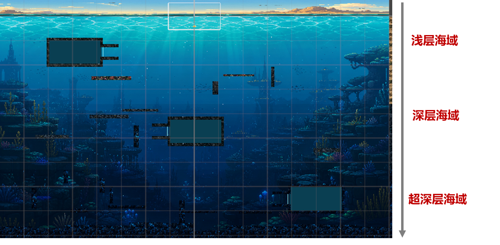

## 3.3 武器

- 战备呼叫：除主武器外，其余武器均需通过战备呼叫进行投送，每种武器有独立的呼叫冷却时间
- 武器大类：
  - 个人武器（白天战斗）：包含主武器、副武器、投掷武器；
  - 塔防武器（夜晚防御）：包含驱逐舰武器、阵地武器；
- 目标总数40+，已有设计：

|    类别    |         名称         | 效果                                         | 冷却时长 |
| :--------: | :------------------: | -------------------------------------------- | -------- |
|   主武器   | 自动步枪（初始装备） | 连续发射子弹                                 | 无       |
|   主武器   |        霰弹枪        | 一次发射多颗子弹，多颗子弹伤害可叠加         | 无       |
|   主武器   |        狙击枪        | 一次发射一颗子弹                             | 无       |
|   副武器   |        冲锋枪        | 快速发射大量子弹                             | 短       |
|   副武器   |     自动瞄准手枪     | 自动瞄准敌方单位                             | 短       |
|   副武器   |       核弹手枪       | 发射一颗小型抛物线飞行炸弹，造成巨额范围伤害 | 中等     |
|  投掷武器  |       诱饵地雷       | 优先吸引敌方单位，3s后延迟爆炸               | 中等     |
|  投掷武器  |      便携式鱼雷      | 直线弹道，碰炸引信造成小范围爆炸             | 长       |
|  投掷武器  |      地狱火背包      | 启动后15s，可按X扔下，造成大范围巨大伤害     | 长       |
| 驱逐舰武器 |    轨道凝固汽油弹    | 持续范围性的投射火焰伤害                     | 长       |
| 驱逐舰武器 |       轨道激光       | 持续5s的激光扫射                             | 长       |
|  阵地武器  |      哨戒加特林      | 自动扫射敌人，优先攻击最前方的单位           | 短       |
|  阵地武器  |      哨戒火箭炮      | 自动瞄准中大型敌人发射火箭炮                 | 短       |
|  阵地武器  |       火焰地雷       | 敌人踩中后造成范围火焰伤害                   | 短       |

## 3.4 敌人与中立单位

### 敌人（水下部分）

- 目标总数40+，已有设计：

|  单位名称  |   分布范围    |                           技能习性                           | 伤害 | 血量 |
| :--------: | :-----------: | :----------------------------------------------------------: | :--: | :--: |
| 小型扑击虫 |  深浅层海域   |                         蓄力直线飞扑                         |  低  |  低  |
| 小型追击虫 |  深浅层海域   |                         持续追击玩家                         |  低  |  低  |
| 中型声波虫 |  深浅层海域   |                 发射远程音波，命中造成2s硬直                 |  低  | 中等 |
| 中型指挥官 |  深浅层海域   |              发出咆哮，附近敌方单位移速加快30%               |  中  | 中等 |
| 大型喷射虫 | 深/超深层海域 | 蓄力后对正前方扇形区域喷射710物质，命中会造成玩家视野大范围减小 |  高  |  高  |
| 大型吞噬虫 | 深/超深层海域 |             蓄力后以自身为圆心的范围内单位被吸引             | 极高 |  高  |
| 小型抱脸虫 |  超深层海域   |          蓄力后弧形飞扑，命中会造成玩家只能使用近战          |  低  |  低  |
|  巨型鱿虫  |  超深层海域   | 区域附近不存在任何单位；蓄力后根据玩家距离会执行远程激光和近战爪击两种攻击方式 |  高  | 极高 |

刷新机制
- 地图上分布数只巡逻队，每只巡逻队为一个中型敌人+5-6只小型敌人
- 大型单位只会在巢穴附近刷新
- 玩家1min内没有进行攻击，总数量会恢复到初始水平

行为
- 自动巡逻
- 探测到玩家/受到攻击 对玩家发起攻击
- 距离玩家超过一定距离恢复巡逻
- 巡逻队受到攻击后超过10s未被击杀，任意小型单位会呼叫增援（在玩家视野范围外刷新2-3只巡逻队前来加入战斗
- 一定范围内会受到玩家枪声吸引移动到玩家所在位置

美术（AI生成供风格参考）

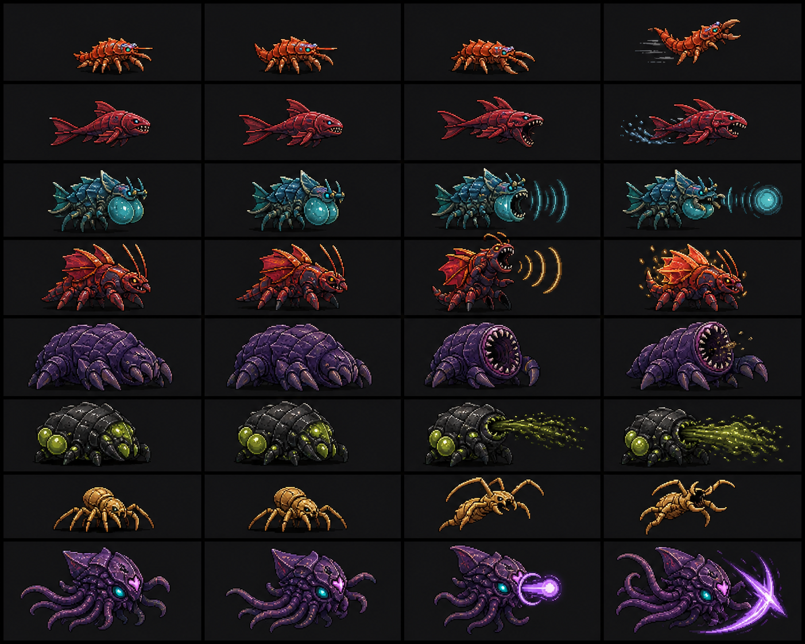

###  中立单位

- 目标总数60+，已有设计：

|     单位名称     |   分布范围    |                           习性特点                           | 速度 |
| :--------------: | :-----------: | :----------------------------------------------------------: | :--: |
|   小型普通飞鱼   |   浅层海域    |                   10只左右楔形队列成群移动                   |  快  |
|   小型幽夜海螺   |  深浅层海域   |        远程可轻易击杀，玩家靠近会缩壳，击杀所需伤害X5        |  慢  |
|   小型原始水虫   |   所有海域    |                     地图上随处可见的生物                     | 中等 |
|     中型骨鱼     |  深浅层海域   |                     移动缓慢的高血量生物                     | 中等 |
|   中型人脸鱿鱼   | 深/超深层海域 |                 受击后会生成光能水泡保护自己                 | 中等 |
|     中型黑鳗     |   深层海域    |                      高速移动的深海生物                      |  快  |
| 巨型光能原始鱿鱼 |  超深层海域   | 受击后会生成巨大光能水泡保护自己并攻击玩家，靠近玩家将提供视野增益 |  快  |
|     巨型跃鲸     |  超深层海域   |                    受击后移速X3并攻击玩家                    |  快  |

- 刷新机制：根据分布范围随机生成，单局战斗内击杀后不再重新生成

- 行为：

  - 小型单位探测到玩家会逃跑
  - 中型单位探测到玩家玩家不会逃跑，受击后会逃跑
  - 大/巨型单位探测到玩家不会逃跑，受击后会攻击玩家

- 美术（AI生成供风格参考）：

  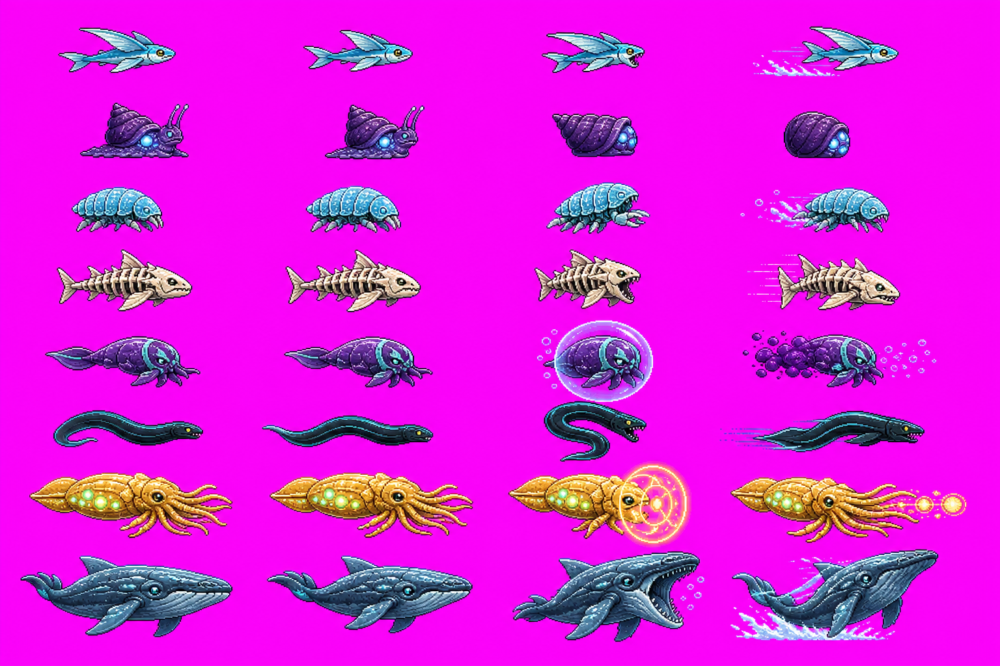

## 3.5 任务

- 概述：每局战斗前玩家会被赋予与剧情相关的1-2项任务，完成可获得超级货币奖励

- 示例任务：夺取终结族巢穴样本
  - 任务要求：玩家需要深入地方巢穴，清除巢穴内的大量敌人和巢穴洞口，并且在采集开始后巢穴内击退敌人增援
  - 任务细节：
    - 采集分为3个阶段，每个阶段都需要玩家触发开始，3个采集阶段完成后自动收集样本
    - 玩家开始采集后，为了确保采集过程正常运转，玩家不能离开采集点太远，否则阶段进度会开始回退
    - 每个阶段的采集开始后，会直接引发敌人增援
    - 巢穴内不能呼叫战备支援
    - 巢穴内的巢穴洞口每分钟会刷新2-3只敌人

  - 设计目的：鼓励玩家解锁高效清杂或大范围杀伤武器


## 3.6 背包

- 按B键打开
- 初始载重 30kg，demo内为100kg以便测试）
  - 可超重100%
  - 超重30%，移速惩罚为初始速度的80%
  - 超重30% 以上，移速惩罚为初始速度的50%

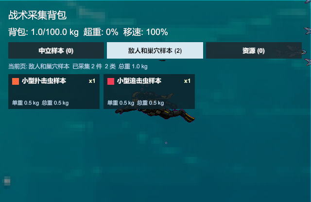

## 3.7 资源

|    名称    |                             图示                             |    分布范围/获得方式    |
| :--------: | :----------------------------------------------------------: | :---------------------: |
|    样本    |  |  击杀敌人/中立单位掉落  |
|  超级货币  |                              无                              | 完成任务/抵御光能族入侵 |
|    植物    | 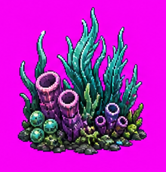 |      浅层海域采集       |
|    矿石    | 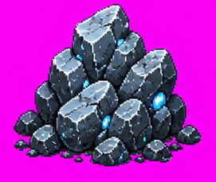 |   浅层和中层海域采集    |
|    残骸    | 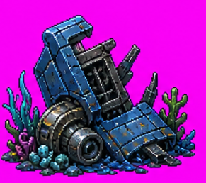 |     超深层海域采集      |
|   鱿鱼卵   |  |  深层和超深层海域采集   |
|  710结晶   | 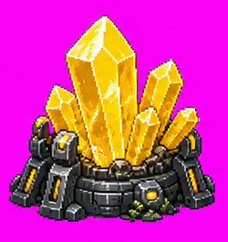 |     超深层海域采集      |
| 巨型鱿鱼卵 | 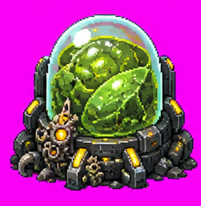 |     超深层海域采集      |

- 样本掉落机制：小型单位大约20%掉落概率；中型单位大约50%掉落概率；大型和巨型单位100%掉落概率
- 武器补给资源：除上述资源外，地图还散步着武器补给资源点，拾取可补给玩家的弹药和针剂

## 3.8 升级

- 武器站

  - 功能：解锁、升级武器（demo内已默认全部解锁）
  - 所需资源：终结族（敌人）样本、超级货币、特殊资源
  - 要求：
    - 不同武器需要收集不同敌人的样本解锁
    - 个人武器通过终结族样本解锁，舰船和阵地武器通过超级货币解锁

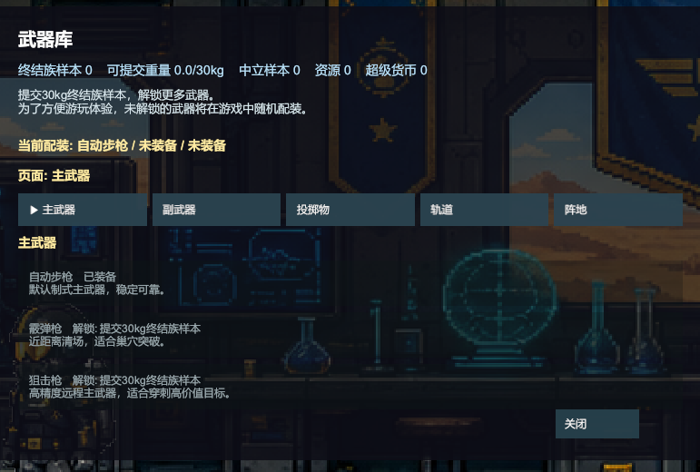

- 科研台

  - 功能：解锁高级科研站功能（如玩家移速，背包载重，撤离等待时长等）

  - 所需资源：中立单位样本、鱿鱼卵、巨型卵等
  - 要求：不同功能需要收集不同敌人的样本解锁

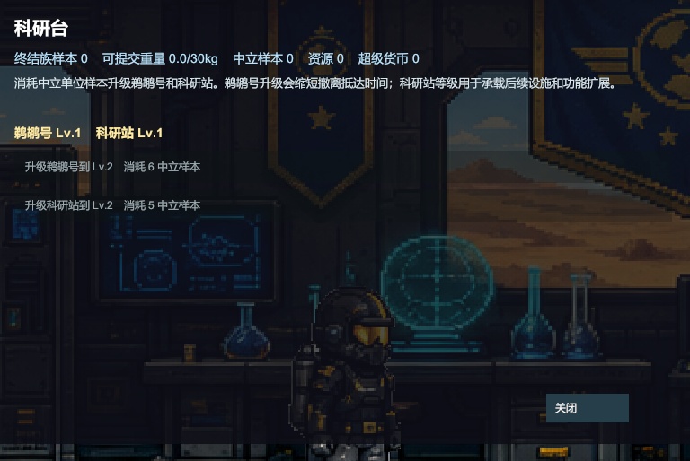

- 工作台

  - 解锁科研站个性化功能

  - 所需资源：植物、矿石、残骸等

  - 要求：达成一定数量即可解锁

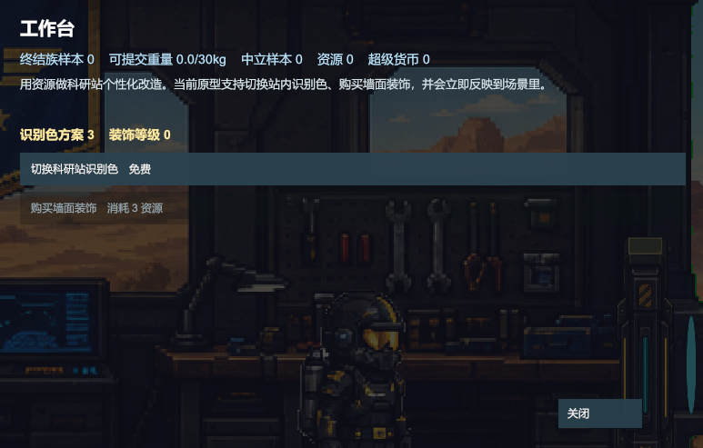

注：为了简化演示，当前demo使用资源总数代替了具体的资源需求

## 3.9 图鉴(未实装)

- 目的：在资源收集外，进一步提升玩家探索的收获感

- 示意图：

  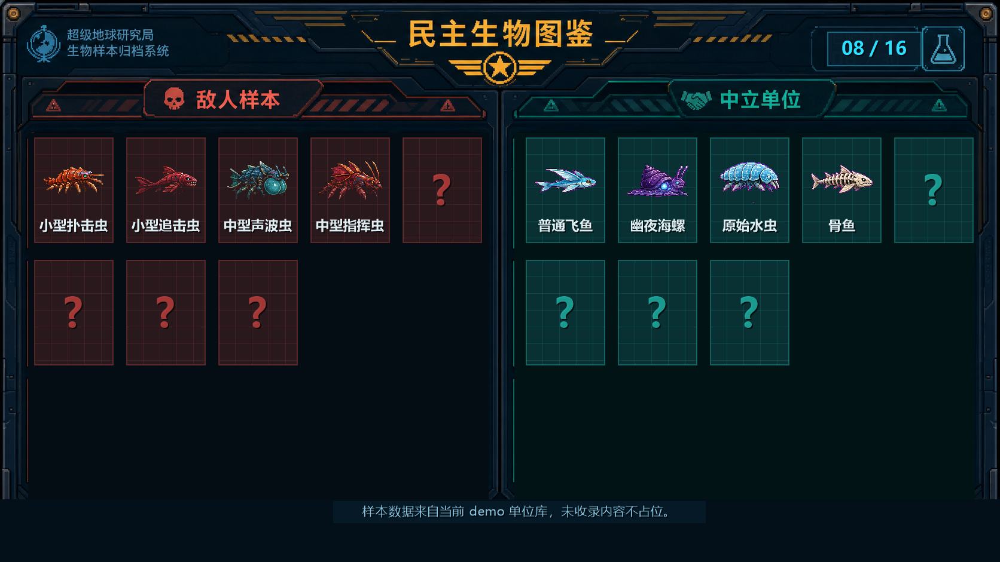


# 4 游戏叙事

## 背景

超级地球在一颗偏远的无人星球的海洋边建立了一个科研站。科研站最初只发现了一些奇异的外型海洋生物，直到大量探索人员在水下失踪。然而，唯一的幸存者从水下带回来了高纯度的710结晶（超级地球的核心燃料）。这种结晶的能量存储效率远高于一般液态的710，该发现引起了超级地球的重视。为了确认这种结晶的存在以及人员失踪的原因，超级地球派来了一位名叫David经验丰富的绝地潜兵（该潜兵因为一次行动中使用燃烧地雷误杀了数位A级公民而被调离前线）前来调查。


## 前期

David初来乍到，被赋予探索海洋包围科研站的双重任务，并遭遇了终结族，说明之前的探索人员失踪极有可能是它们所为。主要任务和事件包括击杀足量终结族并带回样本，深入终结族巢穴并带回样本、首次遭遇光能族进攻等


## 中期

随着玩家深入海洋，David发现了大量之前调查人员的残骸与遗迹沉默在此而非上层海域，并接触到了会发光的鱿鱼生物，David意识到这些发光鱿鱼可能是光能族进攻科研站的原因，并且它们极有可能具有初级智能，是导致那些探索人员失踪的真正罪魁祸首。同时David也弄明白了710结晶形成的原理是在高压和复杂的深海地质环境中形成，说明这种结晶难以量产。主要事件包括击杀发光鱿鱼带回样本、击杀巨型鱿虫带回样本等


## 结局

David最终发现光能族进攻这里是为了挽救他们在进化上的祖先：原始鱿鱼（光能族的外型酷似鱿鱼，武器多为光能武器）。超级地球的扩张行动导致终结族（虫类）扩散到了这颗本属于光能族的星球，并带来了严重的生态污染，导致终结族和这里的原始生物均产生了变异，并进化出了鱿虫这种诡异生物。因此光能族才会不惜冒着巨大风险攻打一个偏远的超级地球科研站。然而一切已为时已晚，在玩家的英勇战斗下，民主再次抵御了暴政......直到某一天巨大的爆炸从太空轨道上传来，David抬头发现，驱逐舰已化作流星从空中坠入无边的沙漠，而无数的光能族战舰正从头顶如暴雨般落下。


